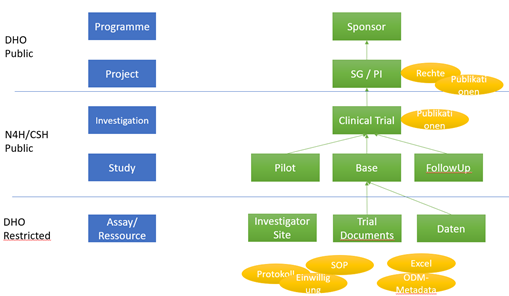
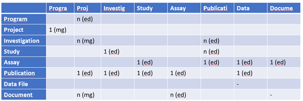
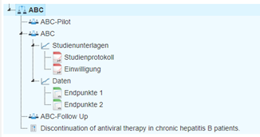
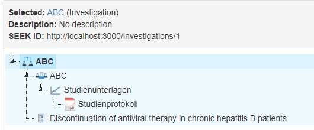
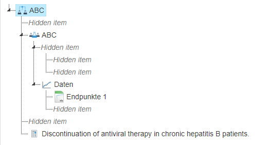
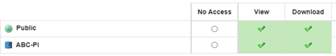

# Kurzanleitung Eingabe SEEK 
## Allgemeine Strukturierung in SEEK 
### Übersicht der Ressourcen 

### Mögliche Vernetzungen 
[//]:<>

||Programme|Project|Investigation|Study|Assay|Publication|Data|Document|
|---|:---:|:---:|:---:|:---:|:---:|:---:|:---:|:---:|
|**Programme**|-|n (ed)|||||||
|**Project**|1 (mg)|-|||||||
|**Investigation**||n (mg)|-|||n (ed)|||
|**Study**|||1 (ed)|-||n (ed)|||
|**Assay**||||1 (ed)|-|1 (ed)|1 (ed)|1 (ed)|
|**Publication**||1 (ed)|1 (ed)|1 (ed)|1 (ed)|-|1 (ed)||
|**Data**|||||||-||
|**Document**||n (mg)|||n (ed)|||-|

*Beispiel: Eine Investigation kann n (also vielen) Projekte zugewiesen werden.  Immer über „Edit“ (=ed), "Manage" (=mg)*
## Beispiel: Eingabe der Studie ABC 

Idee:  Sponsor./Programme ist UL.  Die Projektebene bündelt alle Personen des Forschungsvorhaben (PI und alle die auch Zugriff bekommen sollen). U.U. gilt diese für mehrere Vorhaben. 

### Ziel 

- Programm: University Leipzig (Sponsor)
    - Project ABC-PI
        - Investigation ABC
            - Study ABC-Pilot 
            - Study ABC 
                - Assay: Studienunterlagen
                    - Document: Studienprotokoll 
                    - Document: Einwilligung 
                - Assay: Daten (Beschreibung) 
                    - Datafile Endpunkte 1 
                    - Datafile Tabelle 2 
            - Study ABC-Follow Up 
    - Publikation “Discontinuation…” 

In SEEK soll sich für die Investigation folgendes Bild ergeben:

*Study Tree*

## Klickanleitung 

Es gibt viele Wege zum Ziel. Ressourcen können aus anderen Ressourcen heraus oder eben direkt von der Startseite aus angelegt werden. 

- Einloggen / Startseite 
- Programm anlegen:
    - _Create Programm_
    - Title z.B. „University Leipzig (Sponsor)
    - Muss, je nach SEEK Konfiguration, genehmigt werden 
- Projekt anlegen:
    - In der Programm-Ansicht _„Actions/Create Project“_
    - Muss, je nach SEEK Konfiguration, genehmigt werden“
    - Hier sollte man dann als „Project administrators“ sichtbar sein 
- Investigation anlegen:
    - In der Projektansicht “Add new/Add new Investigation”
    - Bei „Projects“ sollte „ABC-PI“ gewählt sein  
    - Hinweis, wenn die Investigation unsichtbar ist. 
- Study anlegen: 
    - In der Investigationsansicht _„Add new/Add new Study“_

- Assay anlegen:
    - In der Studyansicht „A Modellling analysis“ (oder oder An Experimental assay“) 

- Document anlegen:
    - In der Assay Ansicht „Add new/Add new Document” 
    - Hier nochmal kontrollieren: Projects “ABC-PI“ auswählen 
    - Z.B. lokale PDF „Datei auswählen“ 

- DataFile anlgen:
    - Typisch Local File (Excel) hochladen; alle Angaben füllen, insbesondere Projektassoziation 
- Publication anlegen:
    - Z.b. von Titelseite „Create Publication” 
    - 3 Möglichkeiten: (von Pubmed, Manuelle Eingabe, aus Literatureintrag) 
    - Best Practice: Eingabe über pubmed-id, z.B. 34540953  
    - Zugehöriges Projekt assoziieren, z.B. „ABC-PI“ 
    - „Fetch“ und „Register“ 
    - Evtl. Autoren mit SEEK Nutzer assoziieren oder auch, zusätzlich zum Projekt, mit beliebig anderen Ressourcetypen verbinden, z.B. der Investigation „ABC“ 
    - Nun erst „Save“ 
## Mögliche Ansicht des Ergebnis 

- Projektansicht „ABC-PI“ 
    - Hier Related Items oder „Single Page”  
- Aus Investigationansicht  
    - Entweder Related Items oder kleine Grafik

    - 

## Feintuning 

- Titel ist Pflicht – aber bitte auch immer Description befüllen! 
- Festlegen der Rechte 
- Best-Practice:  Nur Assays evtl. nicht sichtbar; alles andere Public View 

## Rechte 

- Programme, Projekte und Publikationen sind immer öffentlich sichtbar 
- Test z.B. über Ansicht ohne Anmeldung 
- Investigation, Studies, Assays, Data files, Documents nach Wahl über “Manage <'resource>'” , z.B. ist auch sowas  

Für nicht autoriserte User sieht dann die Investigation/Related Item so aus: 

 

Die “+” steht für “Hidden Items” – man sieht also, dass man nicht alles sieht. 