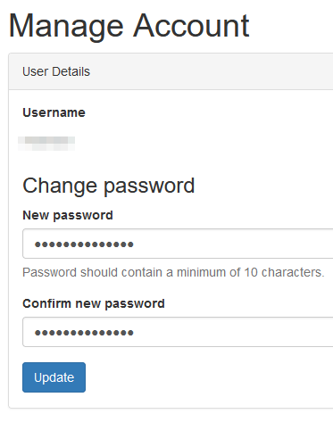

# Profil bearbeiten

Um Ihr Profil zu bearbeiten, müssen Sie eingeloggt sein. Wenn Sie eingeloggt sind, können Sie auf Ihren Namen in der oberen rechten Ecke von LDH klicken.

Wählen Sie ***My profile*** aus dem Dropdown-Menü, um in die Profilansicht zu wechseln oder wählen Sie ***Edit profile*** um gleich in den Bearbeitungsmodus zu wechseln.

Haben Sie ***My profile*** gewählt, navigieren Sie folgend zum Button ***Actions*** in der oberen rechten Ecke und wählen dort ***Edit profile*** aus dem Dropdown-Menü

Die Felder, die Sie bearbeiten können, sind überschaubar und umfassen:

- Vorname
- Nachname
- ORCID-Kennung
- Beschreibung
- Angaben zum Kontakt
- Wissen und Erfahrung
- Positionen im Projekt
- E-Mail-Ankündigungen
- Abonnements

# Passwort ändern
Um Ihr Passwort zu ändern, müssen Sie eingeloggt sein. Wenn Sie eingeloggt sind, können Sie auf Ihren Namen in der oberen rechten Ecke von LDH klicken.

Wählen Sie ***My profile*** aus dem Dropdown-Menü, um in die Profilansicht zu wechseln oder wählen Sie ***Change Password*** um gleich in den Bearbeitungsmodus zu wechseln.

Haben Sie ***My profile*** gewählt, navigieren Sie folgend zum Button ***Actions*** in der oberen rechten Ecke und wählen dort ***Manage Account*** aus dem Dropdown-Menü.

In der folgenden Ansicht können Sie Ihre Anmeldedaten bearbeiten.

