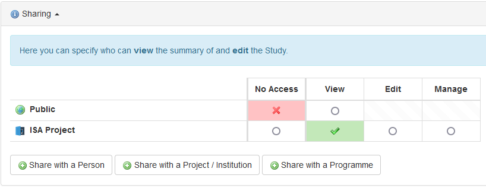
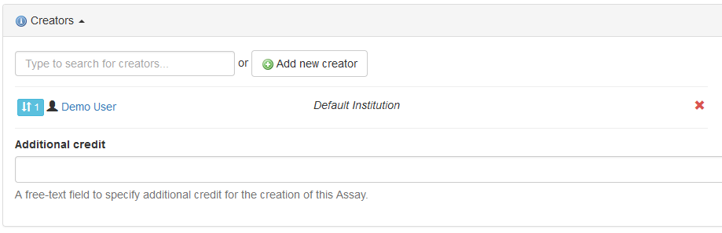
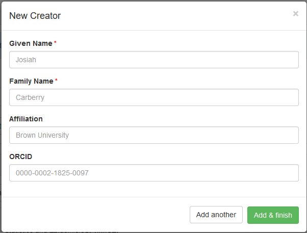
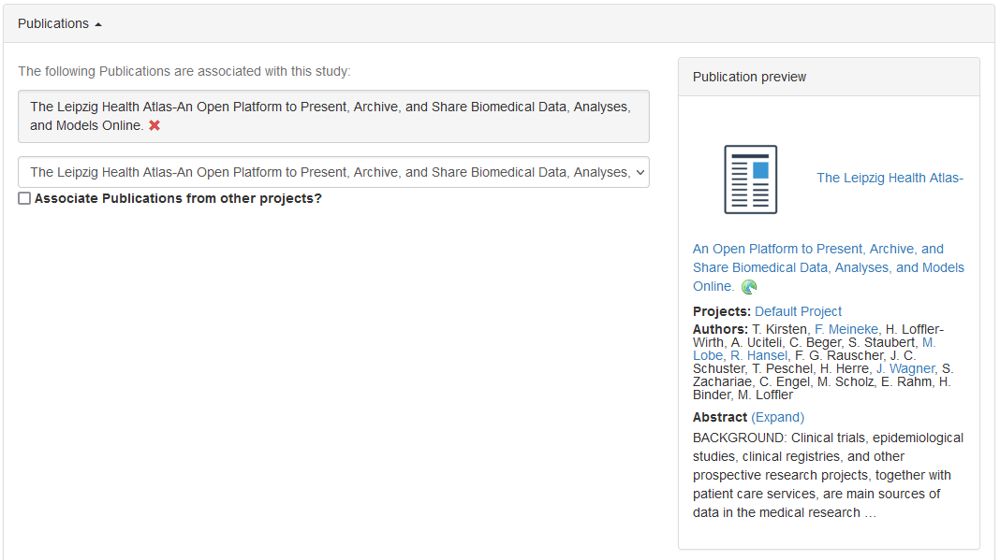

# Allgemeine Verknüpfungsvariablen in LDH

## Titel

Sie sollten die Titel so beschreibend wie möglich gestalten.

## Beschreibung

Die Beschreibung ermöglicht es Ihnen, wichtige Details weiter auszuführen. Beschreibungen können mit [Markdown](https://www.markdownguide.org/basic-syntax/) formatiert werden, entweder über Markup oder über die verschiedenen Optionen oberhalb der Texteingabe (z.B. fett, kursiv, Hyperlinks...). Markdown-Farbband UI

## Projekte

Assets können über das Dropdown-Menü den Projekten zugewiesen werden, in denen sie erstellt wurden. Projekt hinzufügen 1

Mit der Schaltfläche Entfernen können Sie alle ausgewählten Projekte entfernen. Projekt 2 hinzufügen

## Extended Metadata

## Details zur Investigation

###  Studie

[Assay-spezifisch] Sie können einen Assay mit einer bestimmten Studie innerhalb Ihrer Projekte verknüpfen, indem Sie das Dropdown-Menü verwenden.

### Angesprochenes biologisches Problem

[Assay-spezifisch - Modellierungsanalyse] Sie können über das Dropdown-Menü auswählen, welches biologische Problem mit der Modellierungsanalyse behandelt wird. Sie können auch Ihre eigene Modellierungsanalyse hinzufügen, indem Sie die Schaltfläche "Neuer Modellierungsanalysetyp" verwenden.

Angesprochenes biologisches Problem 1
### Assay-Typ

[Assay-spezifisch - Experimentalassay] Sie können einen Assay-Typ aus dem Dropdown-Menü auswählen oder ggf. einen neuen Assay-Typ über die Schaltfläche "Neuer Assay-Typ" erstellen.

Assay-Typ 1

### Technologie-Typ

[Assay-spezifisch - Experimentalassay] Sie können einen Technologietyp aus dem Dropdown-Menü auswählen oder ggf. einen neuen Technologietyp über die Schaltfläche "Neuer Technologietyp" erstellen.

Technologietyp 1

### Organismen

[Assay-spezifisch] Sie können einen Organismus aus dem Dropdown-Menü auswählen.

Organismus 1

## 

### Freigabe

LDH verfügt über fein abgestufte Freigabeberechtigungen. Sie können wählen, ob Sie ein Asset in LDH nur für sich selbst, für ausgewählte Personen innerhalb und außerhalb von LDH, für Ihr gesamtes Projekt oder für die Öffentlichkeit freigeben möchten.

### Schlagwörter

Schlagwörter (Tags) sind Schlüsselwörter, die in irgendeiner Weise für das Asset und seine Eigenschaften relevant sind. Sie werden verwendet, damit relevante Assets von anderen Nutzern bei der Suche nach Schlüsselwörtern leichter gefunden werden können. Um ein Schlagwort hinzuzufügen, geben Sie es einfach in das Feld ein. Während der Eingabe werden Vorschläge für Tags in einem Dropdown-Menü angezeigt. Sie können jeden freien Text für Tags verwenden.

Tags hinzufügen 1

### Zuschreibungen

Eine Zuordnung in LDH ermöglicht es Ihnen, gegebenenfalls das Asset auszuwählen, von dem Ihr Asset abgeleitet wurde (in LDH gespeichert). Während Sie die Zuordnung eingeben, werden die zugehörigen Assets in einem Dropdown-Menü angezeigt.

Tags hinzufügen 1

### Creator

Creator sind andere Personen, die an der Erstellung des Assets beteiligt waren, z. B. durch Planung, Experimente oder Analysen. Dabei muss es sich nicht unbedingt um dieselbe Person handeln, die das Element registriert hat - den Mitwirkenden.

Sie können mehrere Creator hinzufügen, entweder einen nach dem anderen. Beginnen Sie mit der Eingabe des Namens und die passenden Einträge werden angezeigt. Drücken Sie ENTER, Komma oder klicken Sie, um die Person hinzuzufügen.

Im Feld ***"Additional credit"*** können weitere Mitwirkende angegeben werden, welche nicht unter Creators geführt werden sollen. Handelt es sich dabei um mehrere verschiedene Personen, können diese hintereinander, getrennt durch Komma im Freitextfeld aufgelistet werden.

Sie können auch über den Button ***"Add new creator"*** Nicht-LDH-User hinzufügen. Nach klicken erscheint ein kleineres Eingabefenster in dem Vorname und Nachname eingegeben werden müsse. Fakultativ können noch Zugehörigkeit und OrcID angegeben werden.

## SOPs

[Assay-spezifisch] SOPs sind Standardarbeitsanweisungen, die das für die Durchführung des Assays erforderliche Protokoll beschreiben. Sie können in jedem beliebigen Format vorliegen (Word-Dateien, E-Lab-Notebooks, Code, kommentierte Tabellenkalkulationen usw.). Relevante SOPs können über das Dropdown-Menü direkt mit dem Assay verknüpft werden.

## Data-Files

[Assay-spezifisch] Datendateien können alle Dateien sErstellerLDHein, die für den Assay relevante Daten enthalten (Rohdaten, verarbeitete Daten, Kalibrierungsinformationen usw.). Sie können ein beliebiges Format haben (Word-Dateien, E-Lab-Notebooks, Code, kommentierte Tabellen usw.). Relevante Datendateien können über das Dropdown-Menü direkt mit dem Assay verknüpft werden.

## Platzhalter

[Assay-spezifisch] Ein Platzhalter kennzeichnet Daten, die bei der Durchführung eines Projekts verbraucht, verwendet oder erzeugt werden. Platzhalter werden verwendet, wenn die Struktur eines Projekts definiert ist, die Daten jedoch noch nicht bekannt sind, weil das Projekt noch nicht vollständig abgeschlossen ist. Wenn die Daten bekannt sind, kann die Datendatei mit dem Platzhalter verknüpft werden, den sie erfüllt. Platzhalter können überall verwendet werden, wo eine Datendatei sein kann.

## Dateivorlagen

Eine Dateivorlage beschreibt konforme Datendateien. Sie kann mit Informationen über das Format und den Typ der Daten in den Datendateien versehen werden. Die Anmerkungen beziehen sich nicht auf die Dateivorlage selbst. Zum Beispiel kann eine Dateivorlage, die ein Word-Dokument ist, konforme PNG-Bilder beschreiben.

## Publikationen

Wenn Ihr Asset in direktem Zusammenhang mit einer Publikation steht, können Sie die beiden in LDH miteinander verknüpfen. Sie können Publikationen innerhalb Ihres Projekts aus dem Dropdown-Menü auswählen. Wenn sich die Publikation in einem anderen Projekt befindet, müssen Sie das Kontrollkästchen Publikationen aus anderen Projekten verknüpfen aktivieren.

Wenn eine Publikation hinzugefügt wird, erscheint in der rechten unteren Ecke von LDH eine Vorschau. Sie kann bei Bedarf einfach wieder durch klicken  entfernt werden.

## Experimentelle Untersuchungen und Modellierungsanalysen

Es ist am besten, wenn Assets mit Hilfe des ISA-Diagramms kontextualisiert werden. Das bedeutet, dass Assets nach Möglichkeit mit einem Assay oder einer experimentellen Analyse verknüpft werden sollten. Dies kann durch Auswahl eines geeigneten Assays oder einer experimentellen Analyse aus dem Dropdown-Menü erfolgen.
Nach der Auswahl erscheint auf der rechten Seite von LDH eine Assay-Vorschau. Die Verknüpfung kann leicht vom Asset entfernt werden.

## Ereignisse

Wenn das Asset als Teil eines in LDH registrierten Ereignisses erstellt wurde, können Sie das Asset über das Dropdown-Menü mit dem Ereignis verknüpfen.

Ereignis hinzufügen 1

Eine Vorschau des Ereignisses wird auf der rechten Seite von LDH angezeigt, sobald es ausgewählt wurde. Die Verknüpfung kann leicht vom Asset entfernt werden.

Ereignis 2 hinzufügen
