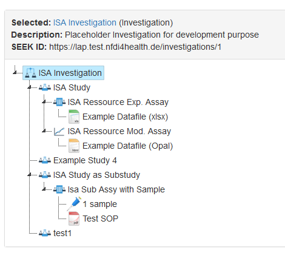
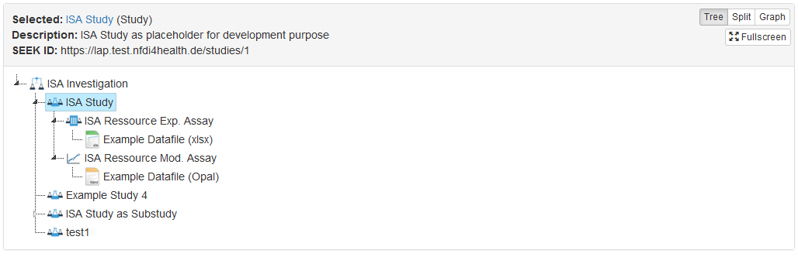
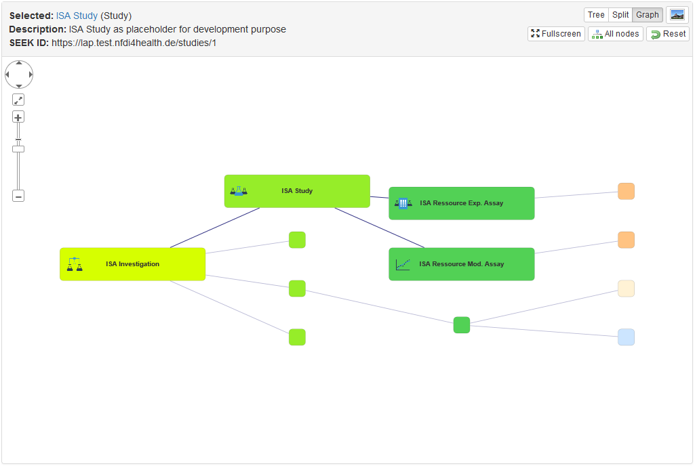
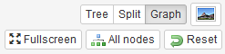
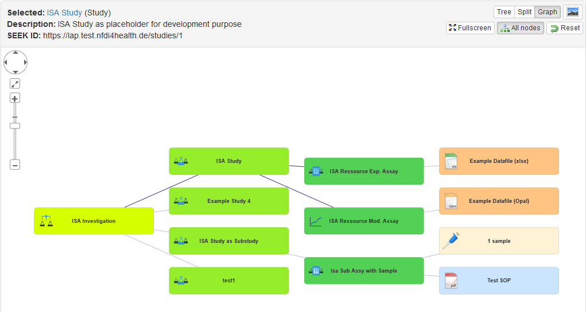
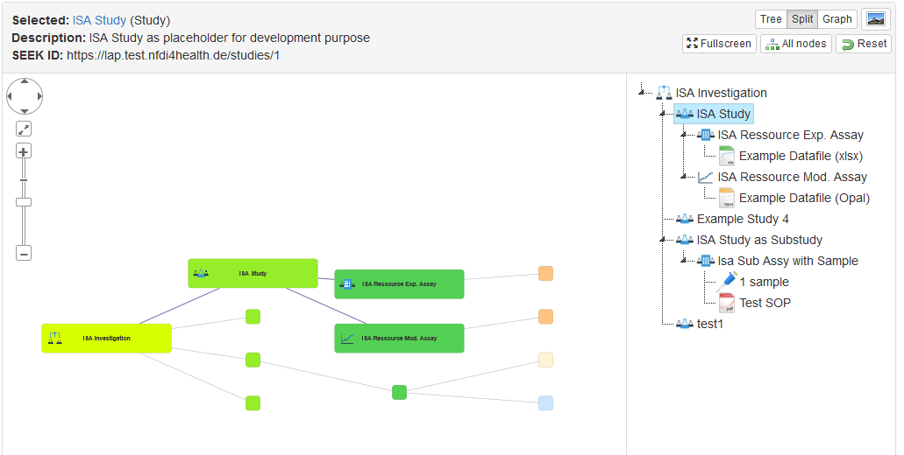

# ISA-Übersicht

## Zusammenfassung

Die ISA-Übersicht ist eine grafische Darstellung des aktuellen Elements in Beziehung zu anderen Elementen innerhalb seiner ISA-Struktur (Untersuchung, Studie, Prüfung).

Sie dient dazu, einen einfachen visuellen Überblick zu geben, und kann auch dazu verwendet werden, zwischen den Elementen in der Ansicht zu navigieren. Durch Doppelklicken auf einen Knoten können Sie direkt zu diesem Element navigieren. Der Titel und die Beschreibung des ausgewählten Elements werden oben angezeigt; langer Text kann vollständig angezeigt werden, wenn Sie mit der Maus über den Text fahren.

Die Übersicht bietet auch die Möglichkeit, das Layout zu ändern und ein Bild für Präsentationen und Berichte zu exportieren.

## Legende der Icons

Um die Identifizierung der ISA-Elemente zu erleichtern, finden Sie im Folgenden eine Zusammenfassung der verwendeten Symbole.

|Icon|Bezeichnung|
|:---:|:---:|
||Programm|
|| Projekt|
|| Institution|
||Investigation|
|| Studie|
||Assay|
||Modellanalyse|
|| Model|
||Publikation|
||Ereignis/Veranstaltung|

SOPs, Data-Filesn, Dokumente und Präsentationen haben Symbole, die ihrem Dateityp entsprechen.

## Baum-Ansicht (Tree)

Die Baumansicht ist die Standardansicht und zeigt die ISA-Struktur in Form von Ordnern an, ähnlich wie ein Dateibrowser. Zu Beginn werden das aktuelle Element und alle darunter liegenden Elemente aufgeklappt dargestellt, während andere Elemente eingeklappt sind. Die eingeklappten Elemente können durch Anklicken aufgeklappt werden. Die Elemente, die unter dem aktuell angezeigten Element liegen, werden ebenfalls mit einem schwachen blauen Hintergrund hervorgehoben.

Wenn Sie z. B. eine Studie anzeigen, wird diese Studie erweitert angezeigt, während die Geschwisterstudien eingeklappt dargestellt werden.

Wenn Elemente mehr als ein übergeordnetes Element haben, z. B. eine Datendatei, die mit mehr als einem Assay verbunden ist, wird sie unter jedem dieser Elemente angezeigt.

Sie können zu einem Element in der Strukturansicht springen, indem Sie darauf doppelklicken.

Eine Vollbildansicht der Struktur kann durch Umschalten auf die Schaltfläche ***"Fullscreen"*** (Vollbild) angezeigt werden und kann durch erneutes Klicken oder Drücken der ESC-Taste wiederhergestellt werden.

## Grafische Ansicht (Graph)

Die grafische Ansicht kann durch Klicken auf die Schaltfläche ***"Graph"*** oben rechts angezeigt werden. Dies zeigt eine grafische Ansicht, in der das Element innerhalb des Netzwerks hervorgehoben wird. Standardmäßig werden nur die unmittelbaren Nachbarn vollständig angezeigt, während andere Knoten kleiner sind. Unmittelbare Verbindungen werden ebenfalls hervorgehoben. Dies trägt dazu bei, die Übersichtlichkeit komplexer Diagramme zu verringern und eine unmittelbare visuelle Vorstellung von der Position des aktuellen Elements im Netzwerk zu erhalten.

Sie können mit dem Diagramm interagieren, indem Sie auf einzelne Knoten klicken, die sich dann zusammen mit ihren nächsten Nachbarn vergrößern. Der Titel und die Beschreibung des ausgewählten Elements werden ebenfalls am oberen Rand aktualisiert.

Wenn Sie möchten, dass alle Knoten vollständig angezeigt werden, können Sie dies über die Schaltfläche ***"All nodes"*** umschalten.

Sie können das Diagramm mit der Maus verschieben und mit den Bedienelementen oben links vergrößern und verkleinern. Einzelne Knoten können auch gezogen und neu positioniert werden.

Wie bei der Strukturansicht können Sie auch hier den Vollbildmodus einschalten. Im Vollbildmodus können Sie mit dem Mausrad hinein- und herauszoomen.

Um das Diagramm als PNG-Bild zu exportieren, klicken Sie auf die Schaltfläche mit dem Bildsymbol oben rechts. Daraufhin wird ein Bild des aktuellen Stands des Diagramms angezeigt, das heruntergeladen werden kann. Das Bild hat eine höhere Auflösung, vor allem, wenn es im Vollbildmodus exportiert wird.

## Geteilte Ansicht (Split)

Die geteilte Ansicht ist eine Kombination aus Baum- und Diagrammansicht, wobei der Baum auf der rechten Seite angezeigt wird. Wenn Sie also auf einen Baumknoten klicken, wird dieser auch im Diagramm hervorgehoben, und wenn Sie auf das Diagramm klicken, wird der Baumknoten ausgewählt und bei Bedarf erweitert. Die geteilte Ansicht funktioniert am besten, wenn sie als Vollbild angezeigt wird.