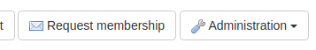

# Projekt beitreten

Sie werden aufgefordert, einem Projekt beizutreten, wenn Sie sich zum ersten Mal registrieren und noch nicht Mitglied eines Projekts sind.

Sie können den Beitritt zu einem Projekt auch auf der Projektseite selbst beantragen. Navigieren Sie dazu zunächst zu der Projektseite. Solange das Projekt einen Administrator hat und Sie noch kein Mitglied sind, sollte eine Schaltfläche "Mitgliedschaft beantragen" verfügbar sein:

Es ist nur möglich, alle 12 Stunden eine Anfrage an dasselbe Projekt zu stellen.

## Projekt auswählen
Wenn Sie diese Seite aufrufen, nachdem Sie auf der Projektseite einen Antrag auf Beitritt gestellt haben, ist das Projekt bereits ausgewählt:

Wenn Sie die Seite direkt aufgerufen haben, z. B. nach der Registrierung, müssen Sie das Projekt auswählen, dem Sie beitreten möchten.

Dazu geben Sie den Namen des Projekts in das Feld ein, woraufhin Vorschläge angezeigt werden. Die Vorschläge ergeben sich aus der Übereinstimmung des eingegebenen Namens mit dem Projekttitel oder einem Teil der Beschreibung. Sie können bis zu 3 auf einmal auswählen. Wenn Sie das gewünschte Projekt nicht finden können, können Sie die gesamte Liste durchsuchen und filtern und dann wie oben beschrieben auf der Seite Projekte einen Antrag auf Beitritt stellen.

## Definieren Sie Ihre Institution

Wenn Sie dem Projekt beitreten, werden Sie mit einer Institution (oder einem Verband) verbunden. Diese müssen Sie bei der Antragstellung angeben. Es steht Ihnen frei, sich für verschiedene Projekte einer anderen Einrichtung zuzuordnen, falls erforderlich.

Beginnen Sie mit der Eingabe des Namens Ihrer Einrichtung, und es werden die vorhandenen Optionen angezeigt, die den von Ihnen eingegebenen Text enthalten (oder mit der Einrichtung in Verbindung stehen, wie z. B. die Stadt). Hoffentlich wird Ihre Einrichtung gefunden und Sie können sie einfach auswählen. Falls nicht, können Sie die oberste Option wählen, um eine neue Institution zu definieren.

Bei der Beschreibung einer neuen Einrichtung ist nur der Titel erforderlich, aber Sie können auch Angaben zu ihrer Website, ihrer Stadt und ihrem Land machen. Sie können die Angaben auch nachträglich bearbeiten und zusätzliche Informationen hinzufügen.

Institution definieren
## Einen Kommentar abgeben

Sie haben auch die Möglichkeit, einen Kommentar abzugeben, um zu beschreiben, warum Sie dem Projekt beitreten möchten. Dies ist besonders wichtig, wenn Sie dem Projektadministrator noch nicht bekannt sind.
## Schritt zur Genehmigung

Ihr Antrag wird an die Projektadministratoren geschickt, entweder per E-Mail oder durch eine Benachrichtigung in FAIRDOM-SEEK. Sie werden dann entweder genehmigt und dem Projekt hinzugefügt oder Ihr Antrag wird abgelehnt. In jedem Fall werden Sie per E-Mail über das Ergebnis informiert.